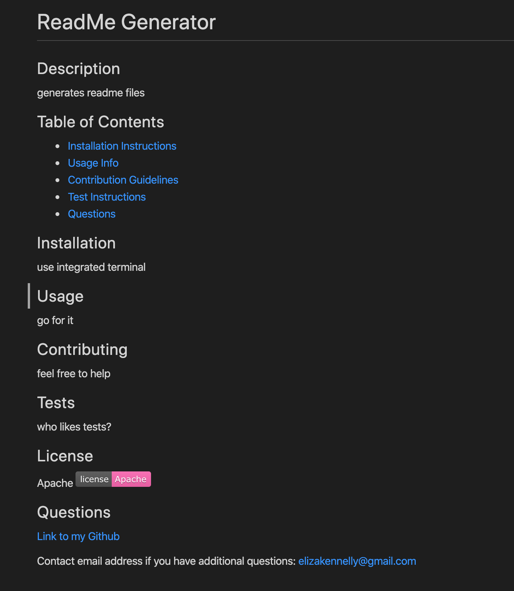

# ReadMe Generator
For this project I created a command line app with Node.js that takes user input and creates a readme file for them. 
To use this project, run an integrated terminal and fill in the criteria that is asked for. 

Screenshots of code

